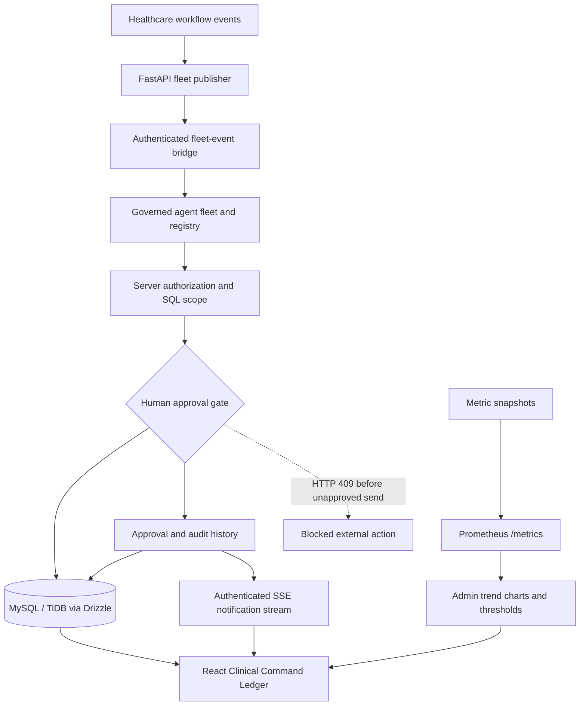

# Gemini Ops Fleet Dashboard

[](https://allthingsagentichackathon.devpost.com/)
[](https://react.dev/)
[](https://www.typescriptlang.org/)
[](https://deepmind.google/technologies/gemini/)

> **Gemini Ops Fleet** is a governed healthcare agent operations console. It makes agent capabilities, evidence boundaries, human approvals, refusal paths, realtime notifications, and operational health visible in one Clinical Command Ledger.

This project was created for the Google **All Things Agentic Hackathon**, specifically the **Fortified Enterprise Fleet** track. It demonstrates how a healthcare agent fleet can prepare useful work without receiving unilateral authority to perform consequential external actions.

## The core idea

Most agent demos optimize for autonomy. Gemini Ops Fleet starts with a different question:

> **What is the fleet structurally unable to do?**

The answer is enforced in server and persistence layers. Operator identity is server-derived. Retrieval is filtered by scope before ranking or synthesis. Agent capabilities and autonomy grades are registered. Sensitive transitions require an authorized human. Premature sends are refused with HTTP 409. Approvals, rejection reasons, role changes, blocked calls, and notifications remain auditable.

## What is included

| Surface | Purpose |
| --- | --- |
| **Clinical Command Ledger** | Overview of agent state, async work, evidence, control boundaries, and protected calls. |
| **Agent Registry** | Registered capabilities, domains, versions, autonomy grades, and restrictions. |
| **Event Stream** | Observable business events with routing, actor, lifecycle state, and blocked outcomes. |
| **Approval Queue** | Server-authorized clinical payloads, Gemini summaries, approve/reject actions, and mandatory rejection reasons. |
| **Audit & Trace** | Durable evidence of successful decisions, refusals, prompt-injection screening, and governance transitions. |
| **Operator Admin** | Role and department management, distribution charts, bounded bulk editing, dry-run previews, and role-change history. |
| **Notification Inbox** | Persistent operator notifications, preferences, toast alerts, and authenticated SSE delivery. |
| **Stream Health** | Connection and delivery-latency charts, selectable time ranges, dropped-client thresholds, and Prometheus metrics. |
| **IPC Command** | Synthetic ward risk signals, evidence-linked infection-prevention tasks, visible resource gaps, and a low-resource operating mode. |

All healthcare records shown in the demo are synthetic. This is a governance prototype, not a clinical decision system.

## Governance controls

| Control | Implementation behavior |
| --- | --- |
| Server-derived identity | Reviewer identity comes from the authenticated server session rather than browser-supplied fields. |
| Role-based access control | Medical Director, Data Scientist, and Payer Operations views and actions are scoped by server authorization. |
| Retrieval boundary | SQL scope is applied before ranking or Gemini synthesis. |
| Human approval gate | Draft actions remain held until an authorized operator approves them. |
| Safe refusal | Unapproved sends are rejected server-side with HTTP 409 Conflict. |
| Durable auditability | Approval transitions, rejection reasons, role changes, blocked calls, and notification records are persisted. |
| Review-first administration | Bulk role changes expose a before/after dry-run and unchanged-user preview before commit. |
| Realtime operations | Authenticated SSE delivers notifications; operational counters and snapshots support Prometheus and admin trend charts. |

## Architecture



The editable architecture source and submission diagram are available in [`docs/gemini-ops-fleet-architecture.mmd`](docs/gemini-ops-fleet-architecture.mmd). The longer submission narrative is in [`docs/devpost-description.md`](docs/devpost-description.md).

## Technology stack

The application uses React 19 and TypeScript for the operator surface, Tailwind CSS and Recharts for the UI, Express and tRPC 11 for typed server contracts, Drizzle ORM with MySQL/TiDB for persistence, Server-Sent Events for realtime delivery, Prometheus text exposition for scraping, and FastAPI as the production fleet event publisher. Gemini-powered summaries are persisted through protected server procedures.

The project is scaffolded with the Manus full-stack web template and includes OAuth session handling, protected tRPC procedures, database migrations, S3 helpers, and Vite development tooling.

## Local development

Install dependencies and start the full-stack development server:

```bash
pnpm install
pnpm dev
```

Run the automated checks:

```bash
pnpm test
pnpm exec tsc --noEmit
pnpm build
```

The browser preview is served by the managed development process. The app uses configured OAuth and database environment variables; do not commit `.env` files or credentials.

## API and operational endpoints

The machine-readable OpenAPI specification is available at [`docs/openapi.yaml`](docs/openapi.yaml) and is served at `/openapi.json` when the application is running. It covers health, tRPC, SSE, fleet-event ingestion, JSON metrics, and Prometheus scraping.

| Endpoint | Access | Purpose |
| --- | --- | --- |
| `/api/trpc` | Session-protected by procedure | Typed dashboard reads and mutations. |
| `/api/notifications/stream` | Authenticated session | Per-operator Server-Sent Events stream. |
| `/api/fleet/events` | Shared ingestion token | FastAPI role/department event bridge. |
| `/api/metrics` | Protected admin or token | JSON operational counters. |
| `/metrics` | Protected admin or metrics token | Prometheus text exposition. |

See [`LIVE_API_SETUP.md`](LIVE_API_SETUP.md) for integration payloads, token configuration, stream behavior, metrics names, and the protected `fleet.infectionControl` contract. Product rationale and primary guidance links are in [`docs/infection-control-product-notes.md`](docs/infection-control-product-notes.md).

## Container execution

Build and run the application with Docker Compose:

```bash
docker compose up --build
```

The dashboard is available at `http://localhost:3000`. Compose starts MySQL with a persistent `mysql_data` volume, waits for the database health check, synchronizes the Drizzle schema with `drizzle-kit push --force`, and then starts the app. The local Compose credentials are development-only values; use managed secrets for any shared environment.

## CI/CD

`.github/workflows/ci-cd.yml` runs on pull requests and pushes to `main`. The verification job starts a MySQL 8.4 service, applies the Drizzle schema, installs with the pinned pnpm version, runs the full persistence-aware Vitest suite, typechecks, and builds the production bundle. A push to `main` then builds the Docker image and publishes immutable SHA and `latest` tags to GitHub Container Registry using the repository's `GITHUB_TOKEN`. See [`DEPLOYMENT.md`](DEPLOYMENT.md) for managed database setup, production environment variables, and permanent hosting publication steps. Use [`.env.example`](.env.example) as a safe local configuration template; never commit `.env` or real credentials.

## Testing and verification

The Vitest suite covers persistence, authorization, role transitions, SSE delivery isolation, fleet-event token validation, Prometheus formatting, and tRPC transport recovery. The project also includes Playwright coverage for authenticated SSE and toast behavior; credentialed staging execution is intentionally separate from the default local test run.

The current dashboard has been verified at desktop and mobile sizes, including the admin role-management view, notification inbox, stream-health charts, time-range selector, and threshold indicators. A transient proxy failure mode that returned HTML to tRPC is handled by a bounded client-side retry wrapper for HTML/5xx responses.

## Repository guide

| Path | Purpose |
| --- | --- |
| `client/src/pages/Home.tsx` | Main Clinical Command Ledger and admin dashboard. |
| `client/src/components/NotificationInbox.tsx` | Persistent notification inbox and preferences. |
| `client/src/lib/trpc-fetch.ts` | Bounded retry handling for transient tRPC HTML/5xx responses. |
| `server/routers.ts` | Protected tRPC procedures and role-scoped operations. |
| `server/notifications.ts` | SSE registry, publication, and operational counters. |
| `server/fleet-event-bridge.ts` | Authenticated, deduplicated FastAPI event ingestion. |
| `server/prometheus.ts` | Prometheus exposition formatter. |
| `drizzle/schema.ts` | Users, profiles, approvals, audit, notifications, telemetry, and metric snapshots. |
| `docs/devpost-description.md` | Copy-ready Devpost project description. |
| `docs/devpost-video-script-en.md` | English four-minute demo narration. |
| `docs/devpost-video-en.srt` | English subtitles for the demo. |
| `docs/gemini-ops-fleet-architecture.mmd` | Editable architecture diagram source. |
| `docs/infection-control-product-notes.md` | Infection-control workflow rationale, safety boundaries, and primary sources. |

## Safety and scope

Gemini Ops Fleet is a hackathon demonstration. Do not place real protected health information, production credentials, or patient identifiers in fixtures, screenshots, logs, or issues. Before production use, review authentication, IAM, database retention, network ingress, audit retention, secret rotation, and clinical safety requirements with the responsible organization.

## License

MIT. See [`package.json`](package.json) for the project license declaration.
