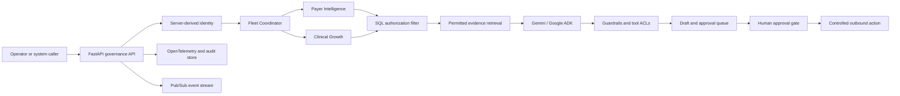

# Gemini Ops Fleet

[](https://allthingsagentichackathon.devpost.com/)
[](https://cloud.google.com/vertex-ai)
[](https://www.python.org/)
[](LICENSE)

> **Gemini Ops Fleet** is a governed multi-agent back-office platform for healthcare operations. It combines Gemini, Google ADK, FastAPI, Cloud Run, Cloud SQL, Pub/Sub, and OpenTelemetry to demonstrate an enterprise fleet in which identity, retrieval, tool access, outbound actions, and audit evidence are enforced in code.

The project was built for the **Google All Things Agentic Hackathon**, specifically the **Fortified Enterprise Fleet** track. Its healthcare workflow demonstrates how payer intelligence and clinical operations can share a coordinated agent runtime without sharing permissions or bypassing human accountability.

## Why Gemini Ops Fleet Exists

Most agent demonstrations optimize for autonomy. Gemini Ops Fleet starts with a different question:

> **What is the fleet structurally unable to do?**

The answer is encoded in server-derived identity, SQL-level retrieval boundaries, explicit agent autonomy grades, tool catalogs, human approval gates, and refusal telemetry. The model can draft and explain work, but it cannot invent an operator identity, retrieve data outside that identity’s scope, or send a sensitive action without a human decision.

## What the Fleet Demonstrates

| Capability | Governance behavior | Primary implementation |
|---|---|---|
| **Server-derived identity** | The caller’s role and employee identity come from the authenticated request context, not model arguments or browser state. | [`app/identity.py`](app/identity.py) |
| **Two-stage retrieval** | SQL authorization filtering runs before keyword or vector-style ranking, so unauthorized records never enter the model context. | [`app/retrieval.py`](app/retrieval.py) |
| **Central agent registry** | Every agent publishes its domain, capabilities, restrictions, and autonomy grade. | [`app/registry.py`](app/registry.py) and [`agents-cli-manifest.yaml`](agents-cli-manifest.yaml) |
| **Human approval gates** | Sensitive workflows remain drafts until an authorized human approves them; premature send attempts return HTTP 409. | [`app/approvals.py`](app/approvals.py) |
| **Prompt-injection interception** | Guardrails inspect risky instructions before the model or a protected tool can act on them. | [`app/guardrails.py`](app/guardrails.py) |
| **Audit and refusal telemetry** | Decisions, denials, citations, and governance attributes are recorded for review and tracing. | [`app/tracing.py`](app/tracing.py) and [`app/store.py`](app/store.py) |
| **Fleet event coordination** | Domain agents operate behind a coordinator and expose HTTP/A2A-compatible boundaries for controlled orchestration. | [`app/fleet.py`](app/fleet.py), [`app/a2a.py`](app/a2a.py) |

## Agent Catalogue

The central registry currently defines two domain agents and one coordinator. The autonomy grade is part of the runtime contract rather than presentation copy.

| Agent | Domain | Autonomy grade | Designed responsibility | Structural restriction |
|---|---|---|---|---|
| `payer_intelligence` | Payer operations | `drafts_only` | Retrieve payer policy, analyze denials, and prepare prior-authorization work. | No send or dispatch tool is exposed. |
| `clinical_growth` | Clinical operations | `drafts_only` | Retrieve clinical guidance, identify care gaps, and prepare outreach work. | No patient-care dispatch tool is exposed. |
| `coordinator` | Cross-domain routing | `read_only` | Propagate server-derived identity and route requests to the correct domain agent. | Cannot execute domain actions. |

The registry is intentionally machine-readable. See [`app/registry.py`](app/registry.py) and [`agents-cli-manifest.yaml`](agents-cli-manifest.yaml) for the declared capabilities and restrictions.

## Clinical Command Ledger Workflow

Gemini Ops Fleet is designed around a **Clinical Command Ledger**: an evidence-led operational surface where every request has a visible owner, permitted scope, evidence trail, decision state, and next accountable action.

1. A request enters through the FastAPI service with an operator token in `X-Fleet-Token` or the deployment’s authenticated request context.
2. The server resolves the operator’s identity, role, and department before the request reaches an agent.
3. The coordinator routes the request to the appropriate domain agent.
4. Retrieval applies the SQL authorization predicate first, then ranks only the permitted records.
5. Gemini produces a grounded draft with extractive citations from the authorized evidence set.
6. Guardrails and tool ACLs evaluate the proposed work. Sensitive outbound actions remain in a draft state.
7. An authorized human reviews, approves, or rejects the action through an HTTP approval gate.
8. The fleet records the decision, refusal reason, evidence, and governance attributes in the audit trail.

This workflow makes refusals and blocked actions observable product behavior rather than hidden exceptions.

## Architecture



The cloud deployment configuration is maintained as Terraform under [`deployment/terraform`](deployment/terraform). The architecture specification and threat model provide deeper design detail in [`docs/architecture_diagram.md`](docs/architecture_diagram.md) and [`docs/threat_model.md`](docs/threat_model.md).

## Technology Stack

| Layer | Technology | Role in the system |
|---|---|---|
| Model and agent runtime | Gemini, `google-genai`, Google ADK | Grounded generation, agent coordination, and structured tool use. |
| API boundary | FastAPI and Uvicorn | Identity-aware governance endpoints and approval lifecycle. |
| Persistence | Cloud SQL PostgreSQL in production; SQLite offline path | Sessions, retrieval records, approvals, and audit evidence. |
| Eventing | Google Cloud Pub/Sub | Controlled asynchronous fleet events with authenticated push delivery. |
| Observability | OpenTelemetry | Traces and attributes for approvals, denials, and fleet activity. |
| Deployment | Cloud Run, Secret Manager, Terraform | Scale-to-zero service hosting and infrastructure-as-code deployment. |
| Operator surface | Streamlit dashboard | Interactive fleet inspection, retrieval review, approval queue, and audit trace. |

The runtime also supports an offline path so the governance behavior can be exercised without cloud credentials.

## Quickstart

The local verification path uses Python 3.10 or newer and `uv`.

```bash
uv sync --group dev
```

Run the unit tests:

```bash
uv run pytest tests/unit -v
```

Run the quantitative governance benchmark:

```bash
uv run python tests/eval/eval_benchmark.py
```

Run the end-to-end governance demonstration:

```bash
uv run python demo.py
```

Start the interactive operator dashboard:

```bash
uv run streamlit run app/dashboard.py
```

The offline path does not require Gemini, Cloud SQL, Pub/Sub, or other cloud credentials. Cloud integrations are activated through environment configuration documented in [`app/config.py`](app/config.py) and the Terraform module.

## Demonstration Scenarios

The proof demonstration intentionally includes both successful and blocked outcomes:

- A permitted payer policy request returns grounded evidence for the caller’s scope.
- A cross-domain retrieval request is filtered before ranking and returns no authorized records.
- A prompt-injection attempt is intercepted by a guardrail before it can alter the workflow.
- A send or dispatch request without a human approval returns HTTP 409 Conflict.
- A human rejection is retained as an auditable decision rather than disappearing from the queue.

Run [`demo.py`](demo.py) to reproduce the local flow. The test suite contains the executable governance claims, including identity isolation, retrieval boundaries, autonomy grades, approval lifecycle, and refusal handling.

## Repository Guide

| Path | Purpose |
|---|---|
| [`app/fleet.py`](app/fleet.py) | Coordinates the governed multi-agent fleet. |
| [`app/agent.py`](app/agent.py) | Defines the agent runtime and Gemini/ADK integration boundary. |
| [`app/routes.py`](app/routes.py) | Exposes FastAPI fleet, approval, and telemetry routes. |
| [`app/identity.py`](app/identity.py) | Resolves server-side operator identity and scope. |
| [`app/retrieval.py`](app/retrieval.py) | Enforces retrieval filtering before ranking. |
| [`app/guardrails.py`](app/guardrails.py) | Applies prompt-injection and citation guardrails. |
| [`app/approvals.py`](app/approvals.py) | Implements human approval and outbound-action gates. |
| [`app/dashboard.py`](app/dashboard.py) | Provides the interactive operator dashboard. |
| [`deployment/terraform`](deployment/terraform) | Defines Cloud Run, Cloud SQL, Pub/Sub, IAM, and Secret Manager infrastructure. |
| [`docs/threat_model.md`](docs/threat_model.md) | Maps threats to code-level mitigations. |
| [`docs/architecture_diagram.md`](docs/architecture_diagram.md) | Describes the system architecture and trust boundaries. |
| [`docs/interview_pitch.md`](docs/interview_pitch.md) | Provides the project pitch and technical discussion notes. |

## Security Notes

This repository is a hackathon demonstration and should not be treated as a clinical production system without additional review. Do not place real protected health information, production credentials, or patient identifiers in local fixtures, logs, screenshots, or issue reports. Before deployment, review IAM bindings, rotate secrets through Secret Manager, validate Cloud Run ingress, and confirm that all audit and telemetry destinations meet the organization’s retention and privacy requirements.

The threat model is maintained in [`docs/threat_model.md`](docs/threat_model.md). It covers identity spoofing, unauthorized retrieval, prompt injection, tampering, denial-of-service considerations, and sensitive-data exposure.

## Roadmap

The next development directions are to connect live HL7 FHIR/EHR sources behind the same SQL RBAC boundary, replace the offline ranking path with pgvector over the already-authorized candidate set, split domain agents into independently deployable A2A services, and connect approval decisions to controlled EHR webhooks.

## License

MIT License. Built for enterprise governance on Gemini and Google Cloud.

## References

[1]: https://allthingsagentichackathon.devpost.com/ "All Things Agentic Hackathon"
[2]: https://cloud.google.com/vertex-ai "Google Cloud Vertex AI"
[3]: https://google.github.io/adk-docs/ "Google Agent Development Kit documentation"
[4]: https://cloud.google.com/run "Google Cloud Run"
[5]: https://fastapi.tiangolo.com/ "FastAPI documentation"
